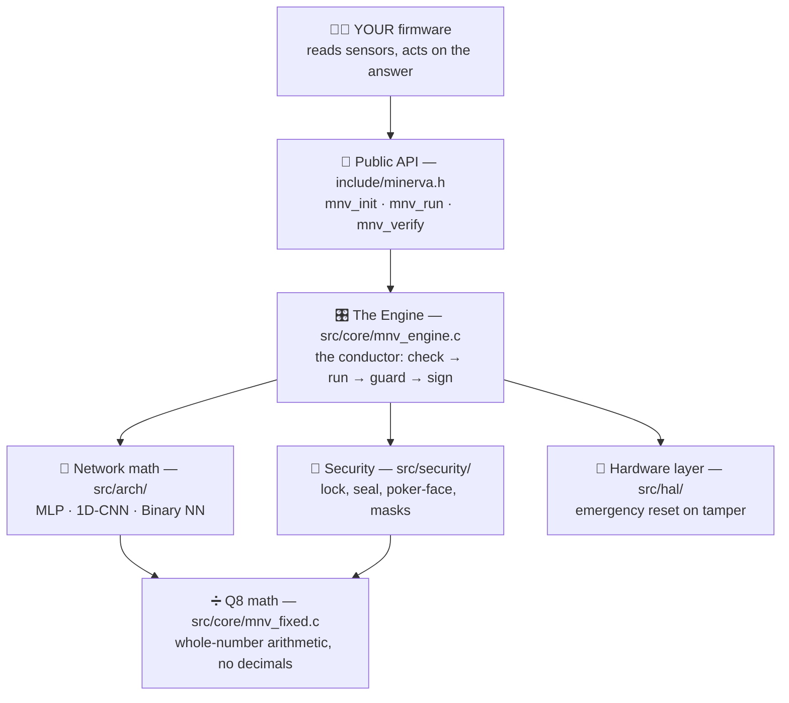
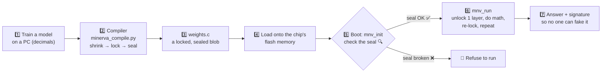
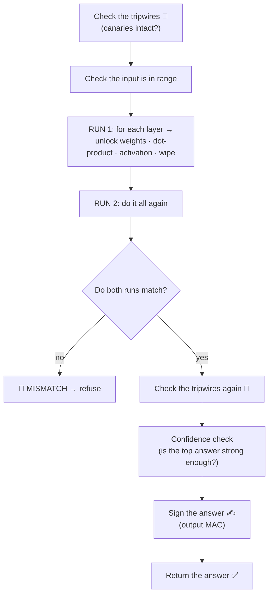
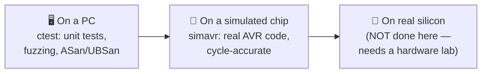

# MINERVA — A Map of the Codebase

*A plain-language tour of what this project is, what it does, and why — with
diagrams. If you've never seen the code before, start here.*

---

## 1. What is this, in one breath?

Imagine a computer chip smaller than a coin, cheaper than a candy bar, with less
memory than a single photo uses. Now imagine you want that tiny chip to run a
small **AI brain** — a neural network that looks at sensor readings and decides
something ("is this machine about to break?", "is this the right person?").

**Minerva is the software that lets a tiny chip do that *safely*.** Not just run
the AI — but keep the AI **secret**, make sure nobody has **tampered** with it,
and never use more memory than it's allowed.

Think of it as a **tiny, locked, tamper-proof safe that also does math.**

---

## 2. Why would anyone want this?

Three reasons, and they're the project's "Three Laws":

| Law | Plain words | Real-world worry it answers |
|---|---|---|
| **I. Certainty** | Never give an answer from a model you haven't checked. | "Did someone swap my AI for a hacked one?" |
| **II. Silence** | Don't leak secrets through timing, power use, or behavior. | "Can someone watch the chip's power meter and steal the model?" |
| **III. Stillness** | Use only memory you reserved up front. Never ask for more. | "Will it crash the tiny chip by running out of memory?" |

The AI model itself is often the **valuable secret** — a company spent months
training it. If a thief dumps the chip's memory, they should get **locked
gibberish**, not the model.

---

## 3. The big picture: how the pieces stack up

Minerva is built in **layers**, like an onion. Your program talks to the top
layer; each layer leans on the one below it.



**Why layers?** So each part does one job well and can be checked on its own. The
Engine doesn't know *how* to encrypt — it just asks the Security layer. The
Security layer doesn't know what a neural network is — it just locks and unlocks
bytes.

---

## 4. The journey of a model (the most important diagram)

A model travels a long road from a data scientist's laptop to a running chip.
Here's the whole trip:



Two everyday analogies for the tricky steps:

- **"Lock" = encryption (ChaCha20).** Like putting the model in a strongbox. The
  key opens it; without the key it's random noise.
- **"Seal" = a MAC (BLAKE2s).** Like the tamper-evident sticker on a medicine
  bottle. If even one byte changed, the sticker is broken and Minerva refuses.

The chip **only unlocks one layer of the network at a time**, does that layer's
math, then **wipes it**. So the whole model is never sitting in memory at once —
less for a thief to grab.

---

## 5. What each folder and file does

```
libminerva/
├── include/            ← the "front door" everyone uses
│   ├── minerva.h         The public API (the buttons you press)
│   ├── mnv_config.h      Settings: which chip, which network, how big
│   └── mnv_types.h       The shapes of the data (structs, status codes)
│
├── src/core/           ← the brain of the operation
│   ├── mnv_engine.c      The conductor: verify → run twice → guard → sign
│   └── mnv_fixed.c       Whole-number math (Q8) + the activation tables
│
├── src/arch/           ← the three kinds of neural network it can run
│   ├── mnv_mlp.c         Classic "fully-connected" network
│   ├── mnv_cnn1d.c       1D convolution (good for signals/time-series)
│   └── mnv_bnn.c         Binary network (weights are just +1 / −1, super tiny)
│
├── src/security/       ← the locks, seals, and disguises
│   ├── mnv_chacha20.c    The lock (encryption)
│   ├── mnv_blake2s.c     The seal + fingerprints (MAC / hashing)
│   ├── mnv_kdf.h         Makes separate keys for each job from one master key
│   ├── mnv_struct_auth.h Seals the model's SHAPE too, not just its weights
│   ├── mnv_ct.c          "Poker face" tools: math with no tell-tale timing
│   ├── mnv_lut.c         Disguised activation lookups (hides which value we used)
│   ├── mnv_outauth.c     Signs the final answer (stops fakes/replays)
│   ├── mnv_prng.h        A cheap random-number source for the disguise
│   └── mnv_endian.h      Tiny helper: read/write 4 bytes in the right order
│
├── src/hal/            ← the only chip-specific code
│   ├── mnv_hal.h         One job: mnv_hal_fatal() = emergency watchdog reset
│   ├── mnv_hal_avr.c       …the AVR (Arduino) version
│   └── mnv_hal_host.c      …the PC version (for testing)
│
├── compiler/
│   └── minerva_compile.py  Turns a trained model into the locked, sealed weights.c
│
├── tests/host/         ← proof it works (runs on your PC + a simulated chip)
│   ├── test_*.c / *.sh   Unit tests, fuzzers, and constant-time checks
│   └── test_avr_sim.sh   Runs the REAL chip code on a simulated Arduino (simavr)
│
├── examples/
│   ├── atmega328p_classify/  A real Arduino app (key kept safely in EEPROM)
│   └── atmega328p_selftest/  A built-in "am I healthy?" self-check
│
└── docs/               ← the "why" and "how safe"
    ├── threat_model.md   Who might attack, and what we do about it
    ├── porting_guide.md  How to move it to a new chip
    └── CODEBASE_MAP.md   ← you are here
```

---

## 6. The security tricks, explained like you're 13

Minerva stacks several small tricks. None is magic; together they add up.

| Trick | In the code | Kitchen-table analogy |
|---|---|---|
| **Encryption** | `mnv_chacha20.c` | The model is in a locked box. No key → random noise. |
| **Integrity seal (MAC)** | `mnv_blake2s.c` | Tamper-evident sticker. One byte changes → sticker breaks → refuse. |
| **Seal the shape too** | `mnv_struct_auth.h` | The sticker also covers the *blueprint*, so no one can rewire the network without breaking it. |
| **Separate keys per job** | `mnv_kdf.h` | One master key makes child keys — a leak in one lock can't open the others. |
| **Constant time** | `mnv_ct.c` | A perfect poker face: the chip takes the *same* time no matter the secret, so timing tells you nothing. |
| **Blinded lookups** | `mnv_lut.c` | Instead of grabbing item #5 off the shelf, it scans the *whole* shelf in a shuffled order, so a power-meter can't tell which item mattered. |
| **Tripwires (canaries)** | `mnv_ct.c` + the context struct | Sentinel values placed *around* the work buffers. If a glitch corrupts memory, a tripwire trips → "glitch!" |
| **Run it twice** | `mnv_engine.c` | Do the math twice and compare. A one-time glitch changes one run → caught. |
| **Sign the answer** | `mnv_outauth.c` | The chip signs its answer so a downstream device knows it's real and not a replay. |
| **Hide the key** | example EEPROM code | The real master key lives in a locked drawer (fuse-protected EEPROM), not baked into the app. |

> **Honest note:** some of these are *proven* (tested on a PC and a simulated
> chip); others are *design goals* that need a real lab with an oscilloscope to
> confirm. The [threat model](threat_model.md) and the README's "Verification
> Status" say exactly which is which — Minerva tries hard not to over-promise.

---

## 7. What happens during one `mnv_run()` — step by step



If **anything** looks wrong at any step, Minerva wipes its scratch memory and
returns an error instead of a possibly-bad answer. That's Law I in action:
**silence beats a wrong answer.**

---

## 8. How we know it actually works

The code is checked at three levels, from easiest to most realistic:



- **On a PC:** hundreds of automated checks, including a *fuzzer* that throws
  200,000 random broken models at the loader to make sure it never crashes and
  never accepts a bad one.
- **On a simulated chip (simavr):** the *actual* Arduino machine code runs on a
  cycle-accurate simulator — this caught a real bug that PC tests couldn't see.
- **On real silicon:** power/EM and fault-injection resistance still need a
  hardware lab. The docs are upfront that this part is unproven.

---

## 9. One-paragraph summary (if you remember nothing else)

Minerva lets a **tiny, cheap chip** run a **small AI model** while keeping that
model **secret and tamper-proof**, using **no surprise memory**. A PC-side
**compiler** locks and seals the model; the chip **checks the seal before it
ever runs**, **unlocks one layer at a time**, keeps a **poker face** so its power
and timing don't leak secrets, and **signs its answers** so no one can fake them.
It's a **locked safe that does math** — and it's careful to only promise the
safety it has actually tested.
